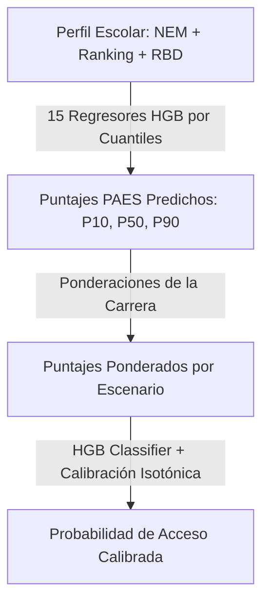

# 🎓 Sistema de Predicción de Acceso a Educación Superior (DAML 2026)
### Departamento de Ingeniería Industrial · Universidad de Concepción

[](https://www.python.org/)
[](https://pacortes2021-damlpaes-srcapp-9nvyyz.streamlit.app)
[](https://scikit-learn.org/)
[](https://pola.rs/)
[](https://plotly.com/)

🚀 **Aplicación en producción:** [Lanzar Dashboard en vivo](https://pacortes2021-damlpaes-srcapp-9nvyyz.streamlit.app)

Este repositorio contiene el **Producto Mínimo Viable (MVP)** desarrollado para la asignatura de **Datos y Aprendizaje de Máquinas (DAML) 2026-1** en la Universidad de Concepción. 

La herramienta es un sistema inteligente de apoyo a la postulación universitaria que estima la **probabilidad calibrada de que un estudiante sea seleccionado en su primera preferencia**, resolviendo la asimetría de información y el riesgo de quedar excluido del proceso de admisión regular (DEMRE).

---

## 🎯 Objetivo del Proyecto

El proceso de admisión universitaria chileno genera una alta incertidumbre. Los puntajes de corte varían de año a año (con una volatilidad histórica de $\approx \pm 24$ puntos) debido al comportamiento de la cohorte y los cambios en las pruebas. 

Este MVP permite al estudiante:
1.  **Ex-Ante (PRE-PAES):** Simular escenarios de rendimiento probable (Pesimista, Probable, Optimista) a partir de sus antecedentes escolares (NEM y Ranking) y el historial del colegio (`RBD_HIST`), prediciendo sus puntajes mediante regresores por cuantiles.
2.  **Ex-Post (POST-PAES):** Evaluar su probabilidad de acceso con sus puntajes reales en mano, analizando su margen de seguridad respecto a los cortes anteriores.

---

## 🛠️ Arquitectura de Machine Learning

El backend del sistema implementa un pipeline secuencial de modelos supervisados entrenados en frío con datos históricos de las cohortes de admisión 2025 y 2026:



### Detalle de los Modelos
*   **Predictores de Puntaje (PRE-PAES):** 15 modelos de **Regresión por Cuantiles (HistGradientBoostingRegressor)** independientes (5 pruebas de admisión $\times$ cuantiles $q_{10}, q_{50}, q_{90}$). Estos modelos estiman de forma continua la distribución de puntajes del postulante combinando sus notas con el rendimiento promedio histórico del establecimiento de origen.
*   **Predictor de Acceso (Target):** Un **Clasificador (HistGradientBoostingClassifier)** entrenado sobre el target binario `ACCESO_1PREF` (Postulantes seleccionados en su 1ª preferencia en modalidad regular). La probabilidad de salida está calibrada mediante **Calibración Isotónica (CalibratedClassifierCV)** para garantizar la honestidad estadística de los resultados.

---

## 🖥️ Tour por el Dashboard (Sección por Sección)

El MVP está estructurado en 5 pestañas interactivas diseñadas con altos estándares estéticos y de usabilidad (CSS Vanilla, gradientes, bordes redondeados y tipografías Inter):

### 1. 🏅 Mi Resultado (Simulador Principal)
*   **Velocímetro de Probabilidad:** Un gráfico de aguja (gauge) animado que refleja de inmediato la probabilidad de quedar seleccionado según el escenario activo.
*   **Escenarios PAES:** Un simulador visual que proyecta tres barras de progreso coloreadas correspondientes a las probabilidades de quedar en escenarios **Pesimista ($P_{10}$)**, **Probable ($P_{50}$)** y **Optimista ($P_{90}$)**.
*   **Boxplot Dinámico:** Representación de la distribución de seleccionados de la carrera seleccionada. Al pasar el mouse, un Scatter transparente superpuesto permite visualizar únicamente el valor del percentil más cercano al cursor (evitando la sobrecarga de información).

### 2. 📖 La Carrera (Ficha Técnica y Estadísticas SIES)
*   **Ficha Académica:** Chips estilizados con colores HSL pasteles que muestran los requisitos de ponderación, el área del conocimiento y la facultad.
*   **Evolución del Corte:** Gráfico de línea limpio que muestra la variación del corte en los procesos 2024, 2025 y 2026 sin distorsiones (eje X categórico para evitar años fraccionados como `2024.5`).
*   **Demanda Histórica:** Gráfico de área sombreada con la evolución de postulantes en primera preferencia desde 2018. Mapeado con coordenadas enteras para evitar bugs de visualización.
*   **Éxito Formativo (SIES 2024):** Visualiza los graduados reales de la carrera desglosados por género y edad (promedio y mediana), además de estadísticas de empleabilidad al 1er año, retención escolar y sobreduración académica promedio y real.

### 3. 🔎 ¿Dónde quedo? (Recomendador Inteligente)
*   **Lógica de Target Inteligente ("Lo mejor que alcanzo"):** Filtra los programas donde el alumno tiene $\ge 50\%$ de probabilidad de acceso y los ordena de **mayor a menor selectividad** (corte) para guiarlo a postular al programa más competitivo a su alcance.
*   **Buscador Flexible:** Permite buscar y rankear la misma carrera en otras universidades y otras carreras afines del área de conocimiento.
*   **Filtros de Control:** Selector dinámico de visualización (15, 30, 50 o todas las filas) y filtro geográfico para limitar la búsqueda a la región del alumno.

### 4. ⚖️ Comparar (Comparación Lado a Lado)
*   **Grid Comparativo:** Permite seleccionar hasta 3 programas universitarios finalistas y contrastarlos directamente en columnas alineadas verticalmente.
*   **Métricas Robustas:** Compara probabilidad de acceso, puntaje mínimo exigido, si requiere rendir la prueba Matemática 2 (M2), arancel anual (expresado en formato de millones con coma chilena, ej. `$4,2M/año`), tasa de matrícula efectiva y desglose de vacantes (PACE, Especiales, Género).
*   **Radar de Ponderaciones:** Un gráfico de araña que superpone los pesos de cada prueba para ver dónde rinde mejor el puntaje del alumno.

### 5. 🗺️ Territorio (Visualizador Geográfico)
*   **Mapas de Calor Continentes:** Mapea el territorio chileno continental recortado para centrar el foco visual en el país. Permite colorear por:
    *   *Tasa de acceso por región:* Demuestra las brechas de centralización en Chile.
    *   *Puntaje promedio por comuna:* Revela visualmente cómo el origen socio-comunal (segregación) condiciona el rendimiento PAES.
*   **Éxito Comunal:** Gráfico de barras interactivo con el Top 10 de comunas con mejor tasa de éxito de acceso, filtrable por región y con el resaltado en rojo de la comuna del alumno.

---

## 📊 Evaluación y Desempeño del Modelo
Durante la fase de experimentación con validación temporal ($2025 \to 2026$), el clasificador de acceso HGB superó a los modelos alternativos gracias a su capacidad nativa de procesar datos faltantes e interacciones complejas:

| Modelo | AUC-ROC | PR-AUC | Brier Score (Calibración) | Accuracy |
| :--- | :---: | :---: | :---: | :---: |
| **HistGradientBoosting (HGB)** | **0.9244** | **0.7854** | **0.1091** | **0.8433** |
| **SVM (Logistic Reg L2)** | 0.9187 | 0.7712 | 0.1118 | 0.8351 |
| **Neural Network (MLP)** | 0.9140 | 0.7634 | 0.1189 | 0.8310 |
| **Random Forest** | 0.9039 | 0.7410 | 0.1205 | 0.8322 |

---

## 🚀 Instalación y Ejecución Local

Para levantar el proyecto en tu máquina local, sigue estas instrucciones:

### Requisitos Previos
*   Python 3.9 o superior
*   Entorno virtual recomendado (`venv`)

### Paso 1: Clonar y configurar entorno
```bash
git clone https://github.com/Pacortes2021/DAMLPAES.git
cd DAMLPAES
python3 -m venv .venv
source .venv/bin/activate
pip install -r requirements.txt
```

### Paso 2: Ejecutar el Pipeline de Datos (ETL y Modelos)
Si deseas regenerar los datasets de modelado o re-entrenar los regresores de cuantiles:
```bash
# 0. Procesar los Archivos D del DEMRE crudos
python3 scripts/00a_build_master_admision.py

# 1. ETL y generación del catálogo consolidado
python3 scripts/00_build_dataset.py

# 2. Entrenar y calibrar clasificadores de acceso PRE y POST
python3 scripts/01_build_models.py

# 3. Entrenar regresores por cuantiles de puntaje PAES
python3 scripts/11_retrain_score_rbd.py
```

### Paso 3: Lanzar la Aplicación Streamlit
```bash
streamlit run src/app.py
```

---

## 🏛️ Contexto Académico y Créditos

Este trabajo fue realizado por el **Grupo 5** del curso **Datos y Aprendizaje de Máquinas (DAML) 2026-1**, del Departamento de Ingeniería Industrial de la Facultad de Ingeniería de la **Universidad de Concepción**.

*   **Profesor:** Juan Carlos Caro
*   **Ayudantes:** Gustavo Lara, Valentín Álvarez
*   **Fuentes de Datos Utilizadas:** 
    *   Bases de Datos de Matrícula e Ingresos del [SIES / Mifuturo.cl](https://www.mifuturo.cl/sies/#) (Mineduc).
    *   Bases de Datos Históricas de Postulación y Selección del [DEMRE](https://portal-transparencia.demre.cl/portal-base-datos) (U. de Chile).
